# AI-Powered Software Engineering

Architecting and Building Production-Grade Web Applications using **GitHub Copilot + MCP**

<div class="abs-br m-6 flex gap-2">
  <a href="https://github.com/mfittko/grossmutters-rezepte" target="_blank" alt="GitHub"
    class="text-xl slidev-icon-btn opacity-50 border-none!">
    <carbon-logo-github />
  </a>
</div>

---
layout: two-cols
layoutClass: gap-8
---

# The LLM Capability Explosion

**Why now is the right time for investing into AI-driven development**

### The Rapid Progress

LLMs have progressed from simple fact-finding to complex software engineering tasks:

- **2022**: Basic web queries
- **2023**: Bug fixes in small libraries
- **2024**: Complex scraping
- **2025+**: Multi-hour engineering tasks

::right::


<div class="text-xs mt-2 opacity-75">

**Source**: METR - The time-horizon of software engineering tasks different LLMs can complete 50% of the time

</div>

<div class="py-2 px-3 bg-purple-50 dark:bg-purple-900 rounded text-sm mt-4">

**The inflection point**: We've crossed the threshold where LLMs can reliably complete meaningful software engineering tasks. This enables new development paradigms.

</div>

---

# The Evolution of Software Development

**From rigid specs to agile chaos and back to spec driven development with AI**


<div class="py-2 px-3 bg-blue-50 dark:bg-blue-900 rounded text-sm mt-2">

**The Pendulum Swing**: Structured specs are back, but now they're **executable** and **generate** code instead of just documenting intent.

</div>

---

# The Vibe-Coding Problem

**Why unstructured AI prompting leads to chaos**

<div style="font-size: 0.85em;">

<div class="grid grid-cols-2 gap-4">

<div>

### The "Vibe-Coding" Approach

```
Developer: "Build me a login system"

AI: *generates code based on assumptions*

Developer: "No, use OAuth"

AI: *rewrites from scratch*

Developer: "Make it work with our database"

AI: *another rewrite, breaks previous fixes*

Developer: "Add rate limiting"

AI: *generates conflicting implementation*
```

**Result**: Hours of back-and-forth, inconsistent code, technical debt

</div>

<div>

### Why It Fails

❌ **No shared context** - AI doesn't know your standards

❌ **Assumption overload** - AI fills gaps with guesses

❌ **State loss** - Each prompt starts semi-fresh

❌ **No quality gates** - Anything goes

❌ **Prompt whack-a-mole** - Fix one thing, break another

❌ **Copy-paste fatigue** - Manually applying generated code

<div class="py-1 px-2 bg-red-50 dark:bg-red-900 rounded text-xs mt-4">

**The chaos**: Vibe-coding feels fast initially, but compounds into unmaintainable systems

</div>

</div>

</div>

</div>

---
layout: two-cols
layoutClass: gap-8
---

# The Spec-Driven Solution

**Bringing structure back—with AI superpowers**

<div style="font-size: 0.85em;">

### The Power Inversion

**Pre-AI**: Specs documented intent, developers interpreted

**AI Era**: Specs are executable, AI implements

<div class="py-1 px-2 bg-blue-50 dark:bg-blue-900 rounded text-xs mt-2">

The game-changer: Specifications **generate** code, not just guide it. No interpretation gap.

</div>

### Various evolving Frameworks, 1 goal!

**GitHub Spec Kit** - Constitutional governance with templates
**Agent OS** - 3-layer context system (Standards/Product/Specs)
**AI Dev Tasks** - Lightweight PRD → Tasks workflow
**This Talk** - Practical implementation with real-world results

</div>

::right::

<div style="font-size: 0.85em;" class="mt-8">

### Common Principles Across All

✅ **Specifications First** - Define before implementing

✅ **Break Down Complexity** - Tasks over monoliths

✅ **Iterative Checkpoints** - Review each step

✅ **Quality Gates** - Enforce standards automatically

✅ **Living Documentation** - Specs evolve with code

✅ **AI as Executor** - Not creative coder, but disciplined engineer

<div class="py-1 px-2 bg-green-50 dark:bg-green-900 rounded text-xs mt-4">

**Sources**: [GitHub Spec Kit](https://github.com/github/spec-kit) • [Agent OS](https://buildermethods.com/agent-os) • [AI Dev Tasks](https://github.com/snarktank/ai-dev-tasks)

</div>

</div>

---

# Key Insight: Constraining AI for Quality

**Templates and standards constrain AI to build correctly**

<div style="font-size: 0.85em;">

<div class="grid grid-cols-2 gap-4">

<div>

### Without Structure ❌

```
Prompt: "Build a login system"

AI assumes:
- Email/password auth
- Session management approach
- Database schema
- Error handling patterns
- Security measures

Result: Plausible but wrong
```

<div class="py-1 px-2 bg-red-50 dark:bg-red-900 rounded text-xs mt-2">

AI fills gaps with assumptions, drifting from your standards

</div>

</div>

<div>

### With Spec-Driven Structure ✅

```markdown
Spec in GitHub Issue:
- [ ] OAuth 2.0 with GitHub provider
- [ ] JWT tokens (15min access, 7d refresh)
- [ ] Redis session store
- [ ] Rate limiting: 5 req/min
- [ ] Tests ≥90% coverage

AGENTS.md enforces:
- TypeScript strict mode
- Atomic commits
- MCP tools for GitHub ops
```

<div class="py-1 px-2 bg-green-50 dark:bg-green-900 rounded text-xs mt-2">

Explicit specs + enforced standards/guardrails = predictable quality

</div>

</div>

</div>

<div class="mt-3 py-1.5 px-2.5 bg-purple-50 dark:bg-purple-900 rounded" style="font-size: 0.8em; line-height: 1.3;">

AI must satisfy precise acceptance criteria that are properly thought through, not just vague prompts.

</div>

</div>

---

# The Paradigm Shift: WHAT > HOW

**Spec-driven AI-enabled development inverts traditional priorities**

<div style="font-size: 0.82em;">

<div class="grid grid-cols-2 gap-4">

<div>

### Agile Software Development

**HOW matters most:**
- Specs evolve with implementation
- Which framework/language?
- Implementation details
- Developer expertise in tech stack
- Open source: Community size

**Result**: Technology choices constrain you for years

</div>

<div>

### Spec-Driven AI-enabled Development

**WHAT matters most:**
- Clear specifications a priori
- Framework maturity & ecosystem
- Security & stability track record
- Performance (both dev and prod)
- Community quality & best practices adoption

**Result**: Technology becomes swappable

</div>

</div>

<div class="mt-2 py-1.5 px-2.5 bg-purple-50 dark:bg-purple-900 rounded text-sm">

**The Future**: Specs become the permanent asset. When dependencies deprecate or superior tech emerges, AI regenerates your app (or even multiple version of it) from specs.

</div>

</div>

---

# The AI Amplification Loop

**AI helps create specs AND execute them**

<div style="font-size: 0.78em; line-height: 1.3;">

<div style="margin-bottom: 0.4rem;">

### 1. AI Assists Spec Creation

From vague ideas to precise specifications: AI helps break down features, identify edge cases, and structure acceptance criteria.

</div>

<div style="margin-bottom: 0.4rem;">

### 2. AI Executes Specs into Code

AI reliably converts specifications into working code, tests, and documentation—amplifying developer effectiveness.

</div>

<div style="margin-bottom: 0.4rem;">

### 3. Specs Enable Systematic Evolution

When requirements change or tech evolves, AI regenerates code from updated specs. Faster iteration, sustained velocity.

</div>

<div class="mt-1 py-1.5 px-2.5 bg-blue-50 dark:bg-blue-900 rounded text-xs" style="line-height: 1.2;">

**The Loop**: Idea → AI helps spec → Spec drives code → Requirements change → Update spec → AI regenerates. Specifications become your source of truth, not implementation details.

</div>

</div>

---

# The Spec-Driven Framework - Part 1

**Setup Phase**: Foundation you build once


### Documentation Hierarchy


<div class="py-1 px-2 bg-blue-50 dark:bg-blue-900 rounded text-sm mt-2">

**Setup once**: README defines "what", AGENTS.md defines "how", roadmap defines "when". Documentation enables AI autonomy.

</div>

<div class="py-1 px-2 bg-purple-50 dark:bg-purple-900 rounded text-sm mt-2">

**Pro Tip**: Use Mermaid diagrams extensively in all docs, especially ARCHITECTURE.md. Visual diagrams (flowcharts, sequence diagrams, ERDs) help both humans and AI understand system design quickly.

</div>

---

# The Spec-Driven Framework - Part 2

**Iteration Phase**: Your daily development loop

```mermaid {scale: 0.5}
flowchart LR
    Feature[New Feature] --> Issue[Create Issue]
    Issue --> Split{Complex?}
    Split -->|Yes| SubIssues[Sub-Issues]
    Split -->|No| Code[AI Codes]
    SubIssues --> Code
    Code --> Tests[AI Tests]
    Tests --> Coverage{≥90%?}
    Coverage -->|No| Tests
    Coverage -->|Yes| PR[Create PR]
    PR --> Review[Review]
    Review --> Merge[Merge]
    Merge --> Feature

    style Coverage fill:#ffe1e1
    style Split fill:#fff4e1
```

```mermaid {scale: 0.45}
flowchart LR
    Code[Code Push] --> Lint{Lint Check}
    Lint -->|Pass| Type{Type Check}
    Lint -->|Fail| Block1[❌ Block]
    Type -->|Pass| Test{Tests ≥90%}
    Type -->|Fail| Block2[❌ Block]
    Test -->|Pass| Build{Build}
    Test -->|Fail| Block3[❌ Block]
    Build -->|Pass| Docs{Docs Check}
    Build -->|Fail| Block4[❌ Block]
    Docs -->|Pass| Security{Security Scan}
    Docs -->|Fail| Block5[❌ Block]
    Security -->|Pass| Deploy[✅ Ready to Merge]
    Security -->|Fail| Block6[❌ Block]

    style Block1 fill:#fee
    style Block2 fill:#fee
    style Block3 fill:#fee
    style Block4 fill:#fee
    style Block5 fill:#fee
    style Block6 fill:#fee
    style Deploy fill:#efe
```





<div class="py-1 px-2 bg-green-50 dark:bg-green-900 rounded text-sm">

Iterate forever: Sub-issues enable parallel work. Quality gates ensure nothing bad merges.

</div>

---

# Building Blocks of the Framework

The essential components that make it work

---
layout: two-cols
layoutClass: gap-8
---

# <span style="font-size: 0.9em;">The Foundation: AGENTS.md</span>

<div style="font-size: 0.85em;">

AI Agent rule definitions standard. Following the [open standard](https://agents.md/) used by 20k+ projects

```markdown {1-13}
# AGENTS.md

## Setup commands
- Install deps: `npm install`
- Run tests: `npm test`

## Code style
- TypeScript strict; pure functions
- Keep DB logic in `lib/db/`

## Testing instructions
- Use `LLM_MODE=mock` in tests
- Maintain coverage ≥ 90%
```

</div>

::right::

<div style="font-size: 0.85em;" class="mt-8">

```markdown {14-23}
## GitHub operations
- ALWAYS use MCP tools for PRs
- Use `mcp_github_create_pull_request`

## Commit guidelines
- Atomic, logically grouped commits
- Never bulk-commit directories
- Format: type(scope): description

## Coverage policy
- Never exclude important files
- All API routes, core logic ≥ 90%
- If coverage drops, add tests
  (don't lower thresholds)
```

<div class="py-1 px-2 bg-blue-50 dark:bg-blue-900 rounded text-xs mt-2">

Codify knowledge once. AI reads it every session.

</div>

</div>

---

# GitHub Issues as Specifications

**Template Structure** - Write specs AI can execute

<div class="grid grid-cols-2 gap-4" style="font-size: 0.85em;">

<div>

```md
### Issue Template

Title: [area] Short description
Type: Backend | Frontend | Fullstack
Epic: #parent (if nested)
Priority: High | Medium | Low
Effort: S | M | L | XL

Scope: What needs building

Acceptance Criteria:
- [ ] Testable requirement 1
- [ ] Testable requirement 2
- [ ] Edge cases covered

Technical Notes (optional)
```

</div>

<div>

### Real Example: Auth System

```md
Type: Backend + Frontend
Epic: MVP Readiness
Priority: High

Scope: User authentication with
session management

Acceptance Criteria:
- [ ] Login/logout flows
- [ ] Secure session cookies
- [ ] Protected routes redirect
- [ ] User profile in DB
- [ ] Tests ≥90% coverage
```

</div>

</div>

<v-click>

<div class="py-1 px-2 bg-blue-50 dark:bg-blue-900 rounded text-sm">

Issues are living specs. AI reads → implements → checks off. Update as you iterate.

</div>

</v-click>

---

# Implementation Patterns

Technical patterns that enable the framework

---

# Test-Driven Quality

Enforce quality with measurable thresholds

<div class="grid grid-cols-2 gap-4" style="font-size: 0.9em;">

<div>

### Coverage Metrics

```yaml
Current: 93% statements, 98% functions
Threshold: 90% minimum

Total: 175 tests
- Unit: 140 tests
- Integration: 28 tests
- E2E: 3 tests
```

### Coverage Policy

✅ Valid exclusions:
- Platform-specific adapters
- Schema-only definitions

❌ Never exclude core logic, never lower thresholds to satisfy constraints!

</div>

<div>

### Test Quality Vigilance

⚠️ **AI may fake coverage**:
- Assertions behind conditionals
- Tests that never fail

✅ **Enforce in AGENTS.md/TESTING.md**:
- Review AI-generated tests
- Require meaningful assertions
- Mutation testing checks
- Use automated code review agents and task specifically

</div>

</div>

---

# Design Principles for AI-Driven Development

**SOLID, KISS, and static typing enable AI to build correctly**

<div style="font-size: 0.78em;">

<div class="grid grid-cols-2 gap-4">

<div>

### Core Principles

**SOLID Principles**
- **S**ingle Responsibility - Clear, focused modules
- **O**pen/Closed - Extend without modifying
- **L**iskov Substitution - Interface contracts
- **I**nterface Segregation - Specific interfaces
- **D**ependency Inversion - Depend on abstractions

**KISS (Keep It Simple, Stupid)**
- Prefer simple over clever
- Avoid meta-programming / excessive abstraction

<div class="py-1 px-2 bg-yellow-50 dark:bg-yellow-900 rounded text-xs mb-2">
**Note**: These are timeless software engineering best practices. With AI, they become **non-negotiable**.
</div>

</div>

<div>

### Why This Matters for AI

✅ **Clear Boundaries** - AI knows where responsibilities end

✅ **Predictable Patterns** - Consistent structure = faster learning

✅ **Easier Reasoning** - Simple code = fewer wrong assumptions

✅ **Better Test Generation** - Focused modules → targeted tests

✅ **Safer Refactoring** - Well-defined interfaces enable confident changes

✅ **Explicit > Implicit** - AI struggles with magic and conventions

</div>

</div>

</div>

---

# Monorepo Architecture for AI Development

**Even for microservices/micro-frontends, monorepos amplify AI effectiveness**

<div style="font-size: 0.85em;">

<div class="grid grid-cols-2 gap-4">

<div>

### Structure Example

```
monorepo/
├── AGENTS.md              # Global standards
├── packages/
│   ├── api-gateway/       # Microservice
│   │   └── AGENTS.md      # specific rules
│   ├── auth-service/      # Microservice
│   ├── recipe-service/    # Microservice
│   ├── web-app/           # Micro-frontend
│   ├── mobile-app/        # Micro-frontend
│   │   └── AGENTS.md      # specific rules
│   └── shared/            # Common code
├── docs/                  # Shared docs
└── .github/               # Unified CI/CD
```

<div class="py-1 px-2 bg-blue-50 dark:bg-blue-900 rounded text-xs mt-2">

**AI Benefits**: Navigate dependencies, propagate changes, verify compatibility—all without leaving context.

</div>

</div>

<div>

### Why Monorepos Work Better with AI

✅ **Single Context Window** - AI sees entire codebase at once

✅ **Shared Standards** - One AGENTS.md for all services

✅ **Nested documentation** - Extend with specific rules/details

✅ **Cross-Service Refactoring** - Single change interface

✅ **Coordinated PRs** - Track related changes across services

✅ **Unified Testing** - Run all tests, verify integrations

✅ **Dependency Management** - Track versions across services

<div class="mt-2 py-1 px-2 bg-purple-50 dark:bg-purple-900 rounded text-xs">

**Polyrepo Problem**: AI loses context switching between repos. Must re-learn standards, can't verify cross-service changes, breaks on interface updates.

</div>

</div>

</div>

</div>

---

# Static Typing as AI Guardrails

**TypeScript/Java/Kotlin/C# guide AI to generate correct code**

<div style="font-size: 0.75em;">

<div class="grid grid-cols-2 gap-4">

<div>

### Define Clear Interfaces

```typescript
// Interface-first design
export interface IDatabase {
  selectOne<T>(sql: string, 
    params: unknown[]): T | undefined;
  selectAll<T>(sql: string, 
    params: unknown[]): T[];
  run(sql: string, 
    params: unknown[]): void;
  close(): void;
}

// AI must satisfy this contract
class SQLiteAdapter 
  implements IDatabase {
  selectOne<T>(...) { /* impl */ }
  selectAll<T>(...) { /* impl */ }
  run(...) { /* impl */ }
  close() { /* impl */ }
}
```

</div>

<div>

### Benefits for AI Code Generation

**1. Immediate Validation**
- Compiler catches wrong return types
- Type mismatches fail at compile-time

**2. Auto-completion Context**
- AI knows available methods
- Parameter types guide implementation

**3. Refactoring Safety**
- Change interface → compiler finds breaks
- No silent failures

**4. Documentation in Code**
- Types = executable documentation
- No drift between docs and code

</div>

</div>

<div class="mt-2 py-1 px-2 bg-blue-50 dark:bg-blue-900 rounded text-xs">

**The Power**: Static typing transforms vague prompts into precise contracts. AI generates code that **must** satisfy the interface, or it won't compile.

</div>

<div class="mt-1 py-1 px-2 bg-yellow-50 dark:bg-yellow-900 rounded text-xs">

**Human vs AI**: Experienced developers can work effectively in dynamic languages—they infer types mentally. AI cannot. Static types are how you communicate your mental model to AI.

</div>

</div>

---

# Atomic Commits & PR Workflow

Logical, focused changes with automated quality gates

<div class="grid grid-cols-2 gap-4" style="font-size: 0.85em;">

<div>

### ❌ Don't

```bash
# Bulk commit entire directory
git add app/
git commit -m "Add app files"

# Multiple unrelated changes
git add .
git commit -m "Fix stuff"
```

### ✅ Do

```bash
# Logical grouping
git add lib/db/adapter.ts lib/db/sqlite.ts
git commit -m "feat(db): add SQLite adapter"

git add lib/db/postgres.ts
git commit -m "feat(db): add Postgres adapter"

git add tests/unit/sqlite.test.ts
git commit -m "test(db): add adapter tests"
```

</div>

<div>

### PR Template
##### (.github/pull_request_template.md)

```md
### Checklist (Required)
- [ ] Lint + type-check passes
- [ ] CHANGELOG.md updated
- [ ] Tests added (≥90% coverage)
- [ ] CI/CD passes
- [ ] No merge conflicts
```

### Process

Create issue using MCP → Assign to Copilot Agent → Generated types + UI + tests + docs → Assign Copilot review → Use MCP to retrieve Copilot review comments → Fix using VSCode Copilot Agent → Check final Copilot review → Verify Checks and Coverage → Merge

</div>

</div>

---

# CI/CD Pipeline

Automated quality gates

<div class="grid grid-cols-2 gap-4" style="font-size: 0.9em;">

<div>

### Quality Checks

- **Lint** - ESLint catches style issues
- **Type-check** - TypeScript validates types
- **Unit tests** - Vitest with 90% coverage
- **Build** - Production build succeeds
- **E2E tests** - Playwright for critical flows
- **Security audit** - npm audit, Dependabot, Snyk

</div>

<div>

```yaml
# .github/workflows/ci.yml
name: CI
on: [push, pull_request]

jobs:
  test:
    runs-on: ubuntu-latest
    steps:
      - npm ci
      - npm run lint
      - npm run type-check
      - npm test
      - npm run build

  e2e:
    ...
```

</div>

</div>

<v-click>

<div class="mt-2 py-1 px-2 bg-blue-50 dark:bg-blue-900 rounded text-sm">

All checks must pass before merge. No exceptions.

</div>

</v-click>

---

# Anti-Patterns to Avoid

**Common pitfalls and how to fix them**

<div style="font-size: 0.85em;">

<div class="grid grid-cols-2 gap-4">

<div>

### Documentation & Quality

❌ **Documentation Divergence**
Don't maintain parallel docs.
Fix: One source of truth (GitHub Issues).

❌ **Lowering Thresholds**
Never lower coverage to merge faster.
Fix: Add tests. Bar doesn't move down.

❌ **Vague Specifications**
Don't write "Add feature X".
Fix: Acceptance criteria AI can check off.

❌ **Skipping CHANGELOG**
Don't defer documentation.
Fix: Update with every PR.

</div>

<div>

### Process & Automation

❌ **Bulk Commits**
Avoid `git add .` with vague messages.
Fix: Review each file, commit logically.

❌ **Manual GitHub Operations**
Don't create PRs manually.
Fix: Use MCP tools for consistency.

❌ **Excluding Important Files**
Don't exclude core logic.
Fix: Only platform-specific code excluded.

</div>

</div>

<div class="py-1 px-2 bg-red-50 dark:bg-red-900 rounded text-sm">

Shortcuts save 5min now, cost hours later.

</div>

</div>

---

# Reference: Tools & Patterns

Additional resources for advanced usage

---

# <span style="font-size: 0.8em;">When to Use Autonomous Agents vs. IDE Agent Mode</span>

<div style="font-size: 0.75em;">

<div class="grid grid-cols-2 gap-4">

<div>

### 🤖 Autonomous Agent (GitHub Issues)

**Assign complete tasks autonomously**

```
Issue: "Improve coverage to 90%"
→ Analyzes → Plans → Writes 58 tests
→ Creates PR → Fixes reviews
Result: 15 min, zero human help
```

**Best For**: 
- Well-defined acceptance criteria
- Systematic, repetitive work
- Background execution (async)
- Multi-file changes
- Can run browser automation (Playwright)

</div>

<div>

### 💬 IDE Agent Mode (Interactive)

**Real-time collaboration in editor**

**Exploratory**: Architecture, API design, debugging, learning

**Refinement**: Code reviews, performance, security, UI/UX

**Best For**: 
- Unclear requirements
- Needs human judgment
- Real-time feedback
- Single-file edits
- Browser Automation with UI debugging

</div>

</div>

<v-click>

<div class="py-1 px-2 bg-purple-50 dark:bg-purple-900 rounded text-sm mt-2">

1. IDE agent for design and specification → Autonomous agent for execution
2. Autonomous agent kicks off PR → IDE agent iterates on feedback
3. **Combine both**: Let agent create foundation, refine with IDE

</div>

</v-click>

</div>

---

# Model Context Protocol (MCP)

**The missing bridge between AI and external systems**

---
layout: two-cols
layoutClass: gap-8
---

# What is MCP?

<div style="font-size: 0.85em;">

**Standard protocol for AI assistants to interact with external tools and data sources**

### The Problem Before MCP

❌ **Manual context switching** - Copy-paste between tools

❌ **Inconsistent implementations** - Each AI has custom integrations

❌ **Limited capabilities** - AI stuck in its sandbox

❌ **No standardization** - Vendors build incompatible solutions


</div>

::right::

<div style="font-size: 0.85em;" class="mt-8">

### MCP Solution

✅ **Unified protocol** - One standard, many implementations

✅ **Extensible** - Connect to any system via servers

✅ **Secure** - Permission-based access control

✅ **Composable** - Mix and match servers as needed

<div class="mt-4 py-1 px-2 bg-blue-50 dark:bg-blue-900 rounded text-xs">

**Think of it as**: REST APIs for AI assistants. Instead of HTTP endpoints, AI calls MCP tools.

</div>

</div>

---

# MCP Architecture

**How MCP connects AI to the world**


<div class="py-1 px-2 bg-purple-50 dark:bg-purple-900 rounded text-sm mt-2">

**Key insight**: MCP servers are adapters. They translate AI tool calls into system-specific operations.

</div>

---

# MCP in Action: GitHub Workflow

**How MCP transforms GitHub operations from manual to automated**

<div class="grid grid-cols-2 gap-4" style="font-size: 0.8em;">

<div>

### Without MCP ❌

```typescript
// 1. Developer manually:
// - Creates branch via git CLI
// - Writes code in editor
// - Commits via git CLI
// - Pushes to GitHub
// - Opens browser
// - Fills PR form manually
// - Copies issue links
// - Adds reviewers by hand

// Result: 5-10 minutes of manual work
// Error-prone: forget checklist items,
// wrong branch, typos in PR description
```

</div>

<div>

### With MCP ✅

```typescript
// AI handles everything via MCP:

// 1. Create branch
mcp_github_create_branch({
  owner: "mfittko",
  repo: "grossmutters-rezepte",
  branch: "feat/add-auth",
  from_branch: "main"
})

// 2. Create PR with template
mcp_github_create_pull_request({
  owner: "mfittko",
  repo: "grossmutters-rezepte",
  title: "[backend] Add OAuth authentication",
  head: "feat/add-auth",
  base: "main",
  body: readTemplate(".github/pull_request_template.md")
})
```

</div>

</div>

---

# MCP Use Cases: Beyond GitHub

**Real-world applications across the development lifecycle**

<div style="font-size: 0.82em;">

<div class="grid grid-cols-2 gap-4">

<div>

```typescript
// 1. Query designs
mcp_figma_get_file({
  fileKey: "abc123",
  nodeIds: ["button-primary"]
})

// 2. AI generates components
// matching exact design specs:
// - Colors, spacing, typography
// - Responsive breakpoints
// - States (hover, focus, disabled)
```

</div>

<div>

```typescript
// Query official docs in real-time
mcp_context7_get_library_docs({
  libraryID: "/vercel/next.js/v15",
  topic: "server actions",
  tokens: 5000
})

// AI gets latest patterns:
// - Up-to-date API references
// - Current best practices
// - Breaking changes in v15

```

</div>

</div>

<div class="mt-2 grid grid-cols-2 gap-4">

<div>


```typescript
// Generate E2E tests from user flows
mcp_browser_navigate({ 
  url: "http://localhost:3000" 
})
mcp_browser_snapshot() // Get page state
mcp_browser_click({ 
  element: "Login button",
  ref: "button#login" 
})
mcp_browser_type({
  element: "Email field",
  ref: "input[type=email]",
  text: "test@example.com"
})

// AI observes actual behavior,
// generates accurate test assertions
```

</div>

<div>

```typescript
// Query schema for informed decisions
mcp_db_get_tables({
  database: "production"
})

// AI understands structure:
// - Table relationships
// - Column types & constraints
// - Indexes for optimization

// Generates migrations that:
// - Preserve data integrity
// - Add proper indexes
// - Handle edge cases
```

</div>

</div>

</div>

---

# MCP Best Practices

**How to use MCP effectively without shooting yourself in the foot**

<div style="font-size: 0.85em;">

<div class="grid grid-cols-2 gap-4">

<div>

### Security & Trust

**1. Trusted sources only**
- Official [modelcontextprotocol/servers](https://github.com/modelcontextprotocol/servers)
- Verified vendor implementations
- Open-source with active maintenance

**2. Isolation strategies**
- Run MCP servers in Docker containers
- Use separate API tokens with minimal scopes

**3. Permission boundaries**
- Read-only servers for documentation queries
- Write access only when necessary

</div>

<div>

### Performance & Token Management

**1. Minimize active servers**
- 3-5 servers max per workflow
- Each server adds 100-500 tokens to context
- 10 servers = 1-5k tokens before any code

**2. Monitor token usage**
- Track MCP overhead in prompts
- Disable unused servers
- Use targeted queries (not broad searches)

</div>

</div>

</div>

---

# MCP Ecosystem: Official Servers (Part 1)

**Reference servers demonstrating MCP features**

<div style="font-size: 0.72em;">

| Server | Purpose | Key Capabilities | Use Case |
|--------|---------|------------------|----------|
| **GitHub** | Repository operations | Create PRs, issues, branches, push files, search code | Automate Git workflow |
| **GitLab** | GitLab integration | OAuth 2.0 auth, project data, issue management, repo operations | GitLab workflow automation |
| **Playwright** | Browser automation | Navigate, click, type, screenshot, assertions | E2E test generation |
| **Context7** | Live documentation | Query official docs, up-to-date examples | Current framework patterns |
| **Figma** | Design access | Read designs, extract tokens, export assets | Design-to-code workflow |
| **Filesystem** | Local file ops | Read/write files with access controls | Safe file operations |
| **Git** | Git operations | Read, search, manipulate repositories | Version control automation |

<div class="mt-2 py-1 px-2 bg-blue-50 dark:bg-blue-900 rounded text-xs">

**Official MCP Servers**: Maintained by the MCP team and vendors. Production-ready with full support.

</div>

</div>

---

# MCP Ecosystem: Official Servers (Part 2)

**Additional example servers and community implementations**

<div style="font-size: 0.72em;">

| Server | Purpose | Key Capabilities | Use Case |
|--------|---------|------------------|----------|
| **Postgres** | Database operations | Query schema, execute SQL, migrations | Database automation |
| **Brave Search** | Web search | Search the web, get current results | Real-time information |
| **Slack** | Team communication | Send messages, read channels, manage threads | Team automation |
| **Linear** | Issue tracking | Create/update issues, manage projects | Project management |
| **Shortcut** | Agile planning | Stories, epics, iterations management | Sprint planning |
| **Chrome DevTools** | Browser debugging | Debug websites, performance traces, DOM/CSS inspection, network analysis | Real-time debugging & verification |

<div class="mt-2 py-1 px-2 bg-green-50 dark:bg-green-900 rounded text-xs">

**Community Servers**: Built by the community, following MCP standards. Check compatibility before production use.

</div>

<div class="mt-2 py-1 px-2 bg-blue-50 dark:bg-blue-900 rounded text-xs">

**Find More**: Browse [github.com/modelcontextprotocol/servers](https://github.com/modelcontextprotocol/servers) for the full ecosystem.

</div>

</div>

---

# MCP Real-World Impact

**Measurable improvements from using MCP in this project**

<div style="font-size: 0.85em;">

<div class="grid grid-cols-2 gap-4">

<div>


**GitHub Operations** (per PR)
- Manual: 8-12 min (create branch, PR form, link issues)
- MCP: 30 sec (automated via tools)
- **Savings**: 90% time reduction

**Documentation Queries** (per lookup)
- Manual: 5-10 min (search docs, verify version)
- Context7 MCP: 10 sec (instant, current)
- **Savings**: 95% time reduction

**E2E Test Generation**
- Manual: 30-60 min (write selectors, assertions)
- Browser MCP: 5-10 min (observe + generate)
- **Savings**: 85% time reduction

</div>

<div>


**Consistency**
- PRs follow template 100% (vs. 60% manual)
- Commit messages standard (conventional commits)
- Issue linking never forgotten

**Accuracy**
- Zero wrong branch merges
- Always latest documentation patterns, correct versions

**Traceability**
- All operations logged in CI
- Audit trail for compliance
- Reproducible workflows

</div>

</div>

<v-click>

</v-click>

</div>

---
layout: two-cols
layoutClass: gap-8
---

# MCP + AGENTS.md Synergy

**Why they work better together**

<div style="font-size: 0.85em;">

### AGENTS.md Enforces Standards

```markdown
## GitHub operations
- ALWAYS use MCP tools for PRs
- Use mcp_github_create_pull_request
- Never create PRs manually

## Commit guidelines
- Format: type(scope): description
- Use mcp_github_push_files
- Atomic commits only
```

AI reads this → Uses MCP correctly

</div>

::right::

<div style="font-size: 0.85em;" class="mt-8">

### MCP Executes Standards

Without AGENTS.md:
```typescript
// AI might try manual git commands
run_in_terminal({
  command: "git push && gh pr create"
})
```

With AGENTS.md + MCP:
```typescript
// AI uses structured, traceable MCP calls
mcp_github_push_files({ ... })
mcp_github_create_pull_request({ ... })
```

<div class="py-1 px-2 bg-purple-50 dark:bg-purple-900 rounded text-xs mt-2">

**Result**: Standards documented once, enforced automatically, executed reliably

</div>

</div>


---

# AI Development Tools

**Essential tools for spec-driven development with AI**

<div class="grid grid-cols-2 gap-4" style="font-size: 0.85em;">

<div>

### AI & Automation
- **GitHub Copilot** - AI pair programmer with chat & inline suggestions
- **MCP Servers** - Context protocol for GitHub, Figma, Browser, Docs
- **GitHub Actions** - CI/CD pipeline for automated quality gates

### Testing & Quality
- **Vitest** - Fast unit tests with coverage reporting (≥90%)
- **Playwright** - E2E testing with browser automation
- **TypeScript** - Static typing (strict mode required)
- **ESLint** - Code linting with auto-fix

</div>

<div>

### Why These Tools?

**GitHub Copilot + MCP**
- AI has context via MCP (GitHub, docs, browser)
- Automates Git operations consistently
- Reduces manual context switching

**Testing Stack**
- Vitest: Fast, built-in coverage
- Playwright: MCP integration for test generation
- TypeScript: AI guardrails via types

**Result**: AI generates better code with proper tooling

<div class="py-1 px-2 bg-blue-50 dark:bg-blue-900 rounded text-xs mt-3">

**Start simple**: Copilot + Vitest + GitHub Actions. Add Playwright and MCP servers as needed.

</div>

</div>

</div>

---
layout: two-cols
layoutClass: gap-12
---

# Community Standards

**Proven standards that enable AI-driven development**

<div style="font-size: 0.9em;">

<div>

### Documentation Standards

**AGENTS.md** - AI agent instructions standard  
→ [agents.md](https://agents.md/) • 20k+ repos

**Keep a Changelog** - Structured change logs  
→ [keepachangelog.com](https://keepachangelog.com/)

**GitHub Issues** - Issues as executable specs  
→ [docs.github.com/issues](https://docs.github.com/en/issues)

### Development Standards

**Conventional Commits** - Semantic commit messages  
→ [conventionalcommits.org](https://www.conventionalcommits.org/)

**GitHub Spec Kit** - Spec-driven development guide  
→ [github.com/github/spec-kit](https://github.com/github/spec-kit)

</div>

</div>

::right::

<div style="font-size: 0.85em;" class="mt-8">

<div>

### Key Resources

**Model Context Protocol**  
→ [modelcontextprotocol.io](https://modelcontextprotocol.io/)

**MCP Server Registry**  
→ [github.com/modelcontextprotocol/servers](https://github.com/modelcontextprotocol/servers)

**Context7 (Live Docs)**  
→ Query official docs in real-time

**Playwright Documentation**  
→ [playwright.dev](https://playwright.dev/)

<div class="py-1 px-2 bg-purple-50 dark:bg-purple-900 rounded text-xs mt-4">

**Why standards matter**: They constrain AI to build correctly. AGENTS.md + Conventional Commits + Issue templates = predictable quality.

</div>

</div>

</div>

---
layout: two-cols
layoutClass: gap-12
---

# The Example Project

**Großmutters Rezepte - Real-world spec-driven development**

<div style="font-size: 0.9em;">

<div>

### What You'll Find

■ **6 merged PRs** showing the complete workflow from specs to production

■ **18 open issues** demonstrating planning and task breakdown

■ **Comprehensive docs/** - Architecture, testing, security patterns

■ **Working CI pipeline** - Automated quality gates

■ **2-day build** from zero to working POC

</div>

</div>

::right::

<div style="font-size: 0.85em;" class="mt-8">

<div>

### Files Worth Reading

■ `AGENTS.md` - Complete agent guide (setup, style, testing, commits)

■ `.github/pull_request_template.md` - PR checklist and quality gates

■ `docs/ARCHITECTURE.md` - System design and patterns

■ `docs/TESTING.md` - Test strategy and coverage policy

■ `docs/API.md` - API reference and route handlers

</div>

<div>

### Start Here

1. Clone: `git clone github.com/mfittko/grossmutters-rezepte`
2. Read AGENTS.md to understand the standards
3. Browse merged PRs to see the workflow in action
4. Study open issues for spec examples

</div>

</div>

---
layout: center
class: text-center
---

# Thank You!

Questions?

<div class="mt-12">

**From Idea to Production: Architecting and Building Production-Grade Web Applications using GitHub Copilot + MCP**

</div>

<div class="mt-8 flex gap-4 justify-center">
  <a href="https://github.com/mfittko/grossmutters-rezepte" target="_blank" class="text-xl">
    <carbon-logo-github /> GitHub Repository
  </a>
</div>

<div class="abs-br m-6 text-sm opacity-50">
  Built with ❤️ using GitHub Copilot
</div>
